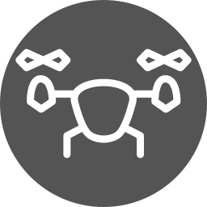
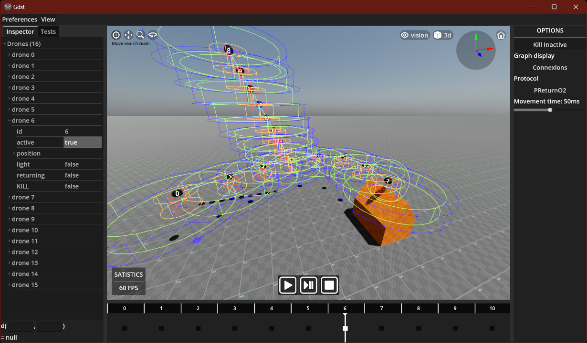

#  GDST

*Godot Drone Simulation Thingy (GDST)* is a small simulator made with Godot 4.0 for a swarm of limited autonomous mobiles robots following the **FSYNC** model created by Suzuki & Yamashita (1999).

 
Simulating base retrieval

## Why ?

Help develop a protocol that solves the "Lifeline" problem where a search team needs to communicate with their base in a hazardous environment.

⚠️ This tool isn't a general-purpose simulator for swarms of autonomous mobiles robots. It focuses only on the "Lifeline" problem.

# Project setup

Import project with Godot 4.0 (standard): https://godotengine.org/

# Wiki

Documentation is available [here](https://github.com/smallcluster/GDST/wiki)
